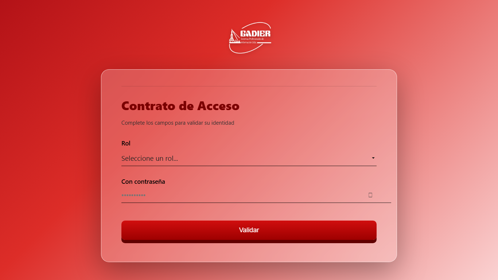
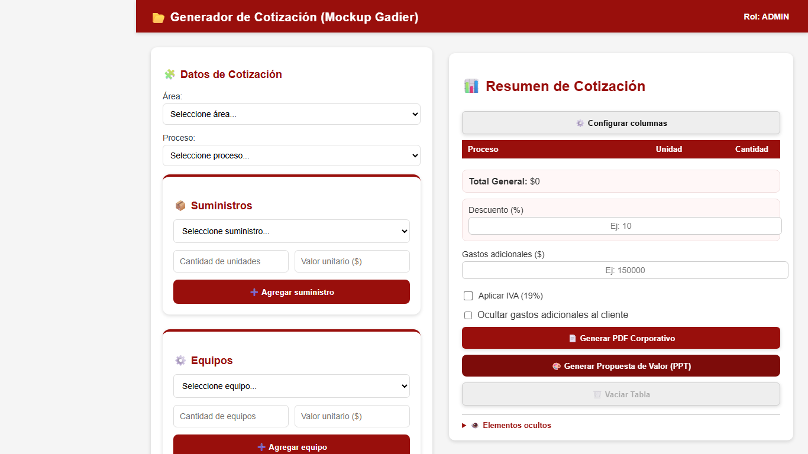
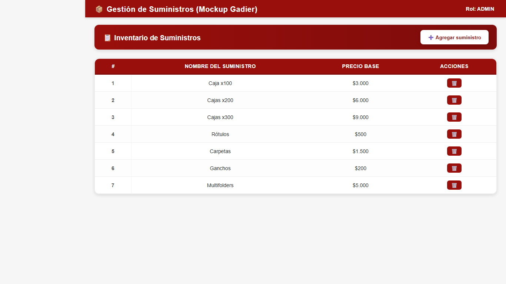
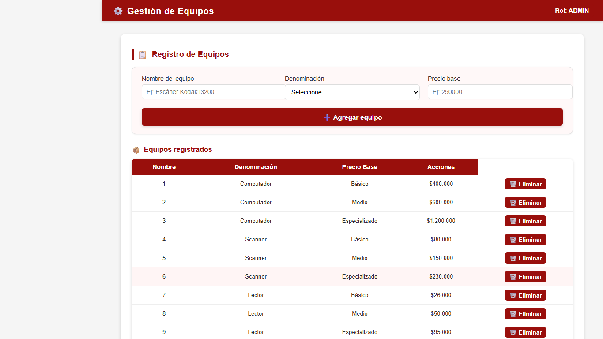
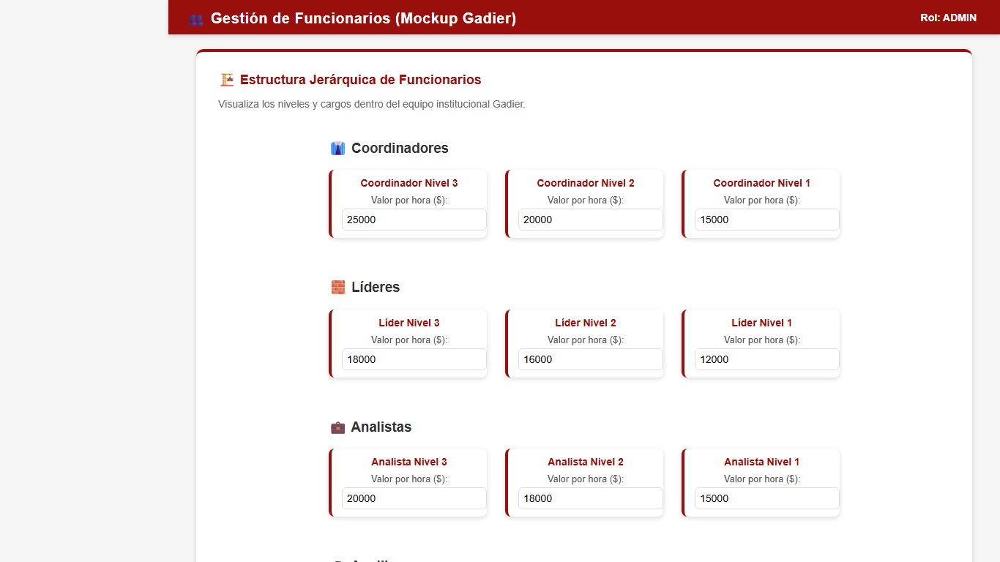
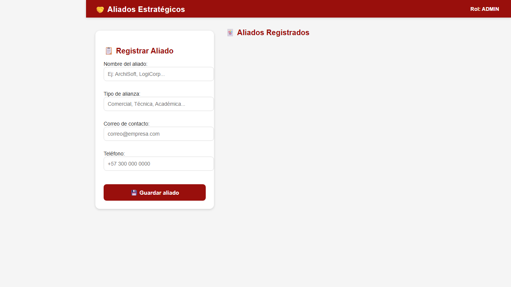
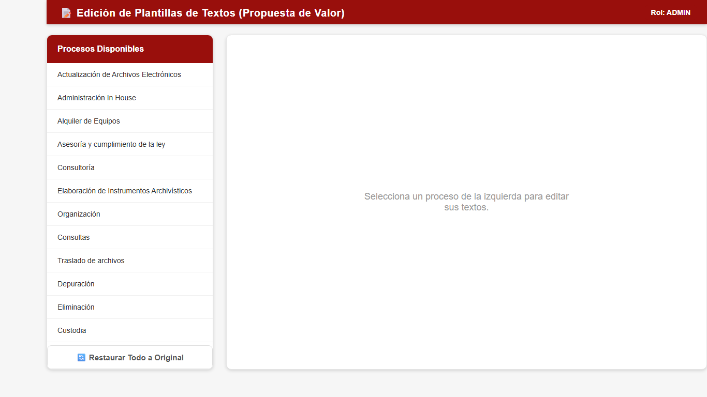

# 📘 Manual de Usuario - Sistema de Cotización Gadier

Bienvenido al **Sistema Integrado de Cotización Gadier**. Este manual le guiará paso a paso en el uso de la herramienta para generar propuestas comerciales, gestionar recursos y emitir documentación corporativa.

---

## 🔐 1. Ingreso al Sistema (Login)

Para acceder a la plataforma, debe validar su identidad confirmando el contrato de acceso.

1.  **Seleccione su Rol**: En el menú desplegable, elija su perfil (Administrador, Cotizador, Soporte, Técnica).
2.  **Ingrese su Contraseña**: Digite la clave asignada a su rol.
    *   *Nota: Puede usar el icono del "ojo" 👁️ para verificar que la contraseña esté correcta.*
3.  **Click en Validar**: Si los datos son correctos, verá la animación de carga y será redirigido al Cotizador.

### 🔑 Credenciales (Uso Interno Mockup)
*   **Administrador**: `admin123`
*   **Cotizador**: `cotiza2025`
*   **Soporte**: `soporte2025`
*   **Técnica**: `tecnica2025`

---

## 📂 2. Generador de Cotizaciones (Módulo Principal)

Esta es la pantalla principal donde se construyen las propuestas.

### Paso 1: Configurar Datos Básicos
1.  **Área**: Seleccione "Archivístico" o "Bibliotecología".
2.  **Proceso**: Elija el servicio principal (ej. "Organización", "Digitalización").
    *   *Opción Personalizada*: Puede elegir "Proceso personalizado" para escribir manualmente un servicio no listado.

### Paso 2: Agregar Subprocesos
Una vez seleccionado el proceso, aparecerá la lista de subprocesos disponibles (ej. "Alistamiento", "Clasificación").
*   **Modo Individual**: Marque las casillas de los ítems que desea cotizar, ajuste la **cantidad** y verifique el **valor unitario**.
*   **Modo Global (Todo el Proceso)**: Si prefiere cobrar un valor único por todo el paquete, use la primera opción "Todo el proceso". Esto deshabita los ítems individuales y permite ingresar un valor global.
*   **Agregar**: Haga clic en el botón **"➕ Agregar al resumen"** para enviarlos a la tabla de la derecha.

### Paso 3: Tabla de Resumen
A la derecha verá todos los ítems agregados.

*   **Eliminar**: Use el icono de basura 🗑️ para quitar un ítem.
*   **Ocultar Ítem 👁️**: Si desea que un costo se cobre pero **no sea visible** en el PDF (costo oculto), haga clic en el ojo. El sistema redistribuirá ese valor entre los ítems visibles automáticamente.
*   **Descuentos y Gastos**: Puede aplicar un % de descuento o sumar gastos adicionales en las casillas inferiores.
*   **IVA**: Marque la casilla "Aplicar IVA" si la cotización lo requiere.

---

## 🛠️ 3. Módulos de Gestión (Sidebar)

Use el menú lateral para acceder a las herramientas de configuración de recursos.

### 📦 Suministros
Gestione el inventario de materiales (Cajas, Carpetas, Ganchos).
*   **Agregar Nuevo**: Click en "Agregar suministro", ingrese nombre y precio base.
*   **Uso en Cotización**: Estos ítems aparecerán disponibles en el desplegable "Suministros" dentro del cotizador principal.

### ⚙️ Equipos
Administre el hardware disponible para alquiler (Escáneres, Computadores).
*   **Registro**: Ingrese Nombre, Denominación (Básico/Medio/Alto) y Precio Base.

### 👥 Funcionarios
Herramienta avanzada para cálculo de costos de personal.
1.  **Organigrama**: Visualice la estructura jerárquica (Coordinadores, Líderes, Analistas).
2.  **En el Cotizador**: Ingrese el número total de funcionarios y días hábiles del proyecto. El sistema calculará el costo estimado por nómina y viáticos.

### 🤝 Aliados Estratégicos
Base de datos de proveedores y socios.
*   **Registro**: Guarde la información de contacto y tipo de alianza.
*   **Servicios**: Dentro de cada aliado, puede listar los servicios específicos que ofrecen para agregarlos rápidamente a futuras cotizaciones.

### 📝 Plantillas (Textos)
Editor de la narrativa comercial.
*   Aquí puede modificar los textos por defecto (Descripción y Beneficios) que aparecen en las diapositivas de la Propuesta de Valor.
*   Los cambios se guardan localmente. Puede usar "Restaurar" para volver a los textos originales.

---

## 📄 4. Exportación de Documentos

Una vez terminada la cotización en la tabla de resumen:

### 🔴 Generar PDF Corporativo
1.  Click en **"📄 Generar PDF Corporativo"**.
2.  **Datos del Cliente**: Se abrirá una ventana para ingresar nombre, NIT y contacto del cliente.
    *   *Favoritos*: Si es un cliente recurrente, selecciónelo de la lista "Clientes guardados" para autocompletar.
3.  El sistema descargará un archivo PDF membretado con la tabla formal de costos.

### 🟠 Generar Propuesta de Valor (PowerPoint)
1.  Click en **"🎨 Generar Propuesta de Valor (PPT)"**.
2.  Ingrese los datos del cliente (igual que en PDF).
3.  El sistema generará una presentación `.pptx` editable con:
    *   Portada personalizada.
    *   Diapositivas de cada proceso con su descripción y beneficios (tomados de Plantillas).
    *   Diapositiva final de inversión económica.

---

## 💡 Consejos Útiles
*   **Guardado Automático**: El sistema recuerda sus últimos clientes y cambios en plantillas en este navegador.
*   **Costo Oculto**: Use esta función para manejar márgenes internos o imprevistos que no desea detallar al cliente final.
*   **Logout**: Recuerde cerrar sesión en el menú lateral al terminar para proteger la información.

---
*Gadier Sistemas - Documentación Interna 2025*
